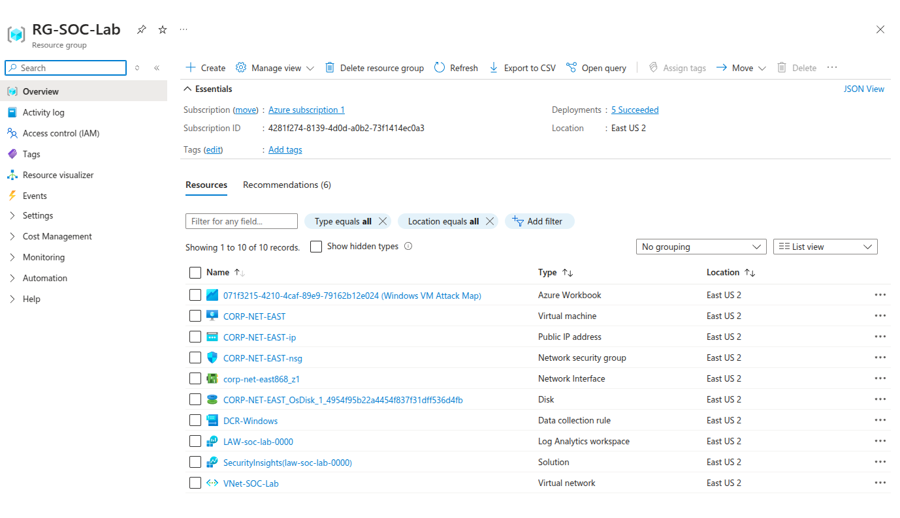
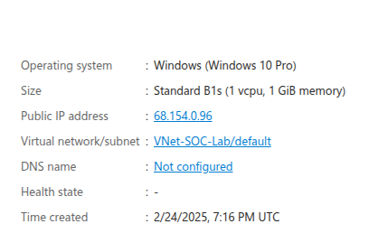
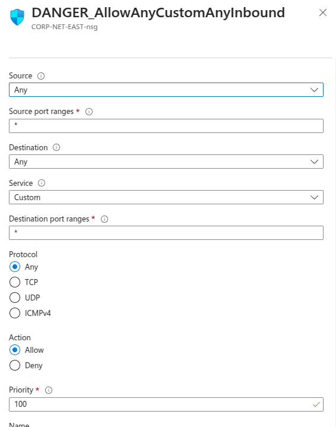
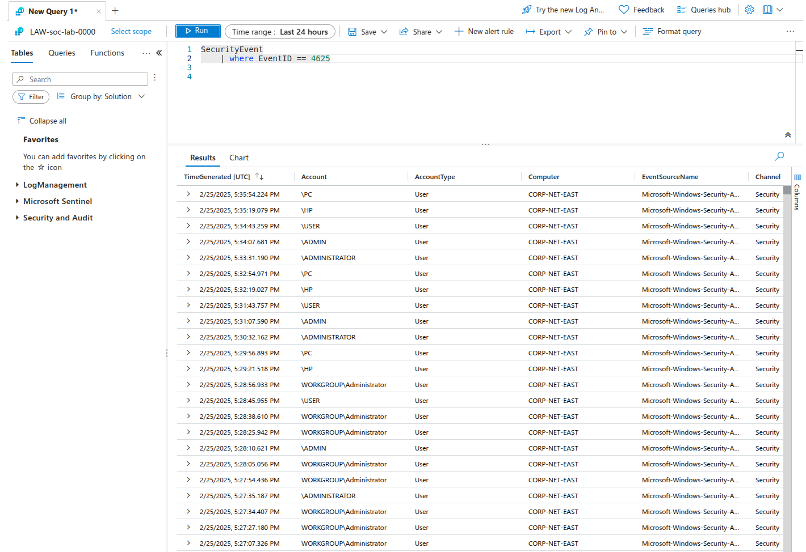
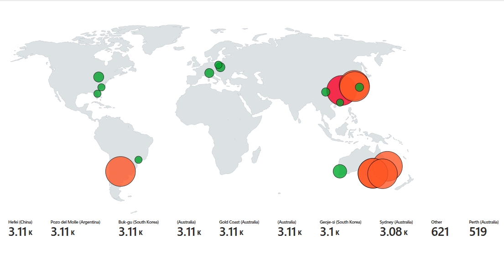

# Azure SOC Simulation Project (Microsoft Sentinel 2025)

## What I Learned from This Project

By completing this project, I learned a lot about different Azure services and how they work together to create a security operations center (SOC) setup. Setting up the Virtual Machine, configuring Network Security Groups, and working with Microsoft Sentinel gave me a better understanding of how security professionals monitor threats in real time.

One of the biggest takeaways was how important **logs and SIEM tools** are for detecting and responding to attacks. Before this, I didn’t fully realize how much data security teams rely on to catch suspicious activity. Working with **Log Analytics and KQL** made it clear how powerful these tools are for filtering through security events and identifying potential threats.

I also got a deeper understanding of **network security** and how **NSGs** play a major role in protecting cloud-based resources. By intentionally exposing the VM to attacks, I saw firsthand how vulnerable machines are without the right configurations. Disabling the firewall and allowing all inbound traffic quickly turned the VM into a target, reinforcing why proper security measures are necessary in any cloud environment.

Another interesting part was using **GeoIP data** to track where failed login attempts were coming from. It was cool to see real-world attack patterns and understand how attackers operate across different regions. This experience gave me a better idea of how security teams use threat intelligence to analyze and respond to incidents.

Overall, this project showed me the **real impact of security misconfigurations** and how tools like **Microsoft Sentinel, Log Analytics, and KQL** help professionals stay ahead of threats. It was a hands-on way to see how security monitoring works in cloud environments and why proactive defenses are so important.

## How I created this simulation

This project was built using resources on Azure and can be replicated using Azure's free tier.

## **Setup Process**

### **1. Creating the Foundation**

- Set up a **Resource Group** to manage all related resources.
- Create a **Virtual Network (VNet)** to facilitate communication between resources.
    
    
    

### **2. Deploying the Honeypot (VM)**

- Provisioned a **Windows 10 Pro** virtual machine using the **Standard B1s** instance (1 vCPU, 1 GiB memory).
- Configured the VM with essential settings for monitoring attacker activity.
    
    
    

### **3. Configuring Network Security Rules**

- Modified the **Network Security Group (NSG)** to allow **all inbound traffic**, enabling attackers to attempt unauthorized access to the machine.

This setup serves as an entry point for malicious actors, allowing for monitoring and analysis of attack patterns using **Microsoft Sentinel**.



### **4. Disabling Firewall for Unrestricted Access**

- Used **Remote Desktop Protocol (RDP)** to access the virtual machine.
- Disabled the **Windows Firewall** within the VM to further expose it to potential attacks.

### **6. Setting Up Microsoft Sentinel for Threat Monitoring**

- **Created a Log Analytics Workspace (LAW)** to store and analyze security data.
- **Deployed a Microsoft Sentinel instance** and connected it to the Log Analytics Workspace for SIEM capabilities.

### **7. Configuring Security Event Logging**

- Configured the **"Windows Security Events via AMA"** connector to collect security-related logs from the virtual machine.
- Created a **Data Collection Rule (DCR)** within Sentinel to monitor extension creation events.

### **8. Querying Logs in Log Analytics Workspace**

- Used KQL to query security logs within the Log Analytics Workspace, analyzing attack patterns and system activity.
    
    
    

### **9. Adding GeoIP Data in KQL Queries**

- Since the logs lack location data, a **GeoIP CSV file** was imported as a **Sentinel Watchlist** to enrich logs with geographic information.
- This allows us to track **attack origins** by mapping IP addresses to locations.

### **10. Querying Logs for Geographic Insights**

- Used **KQL** to integrate GeoIP data with failed login attempts (`EventID 4625`).
- The following query retrieves the locations of all failed login attempts:
    
    ```
    let GeoIPDB = _GetWatchlist("geoip");
    SecurityEvent
    | where EventID == 4625
    | order by TimeGenerated desc
    | evaluate ipv4_lookup(GeoIPDB, IpAddress, network);
    
    ```
    
- Since ISPs allocate IP ranges to specific regions, this method helps **approximate attacker locations** based on their IP addresses.
- Observing the logs now reveals **geographic data**, enabling visualization of attack sources on a map.

### **11. Creating the Attack Map in Sentinel**

- Created a **new Workbook** in Microsoft Sentinel.
- Removed all **prepopulated elements** and added a **"Query"** element.
- Navigated to the **Advanced Editor** tab and pasted the JSON configuration for the attack map (`map.json`).

### **12. Attack Map Configuration (map.json)**

```json
{
	"type": 3,
	"content": {
	"version": "KqlItem/1.0",
	"query": "let GeoIPDB_FULL = _GetWatchlist(\"geoip\");\nlet WindowsEvents = SecurityEvent;\nWindowsEvents | where EventID == 4625\n| order by TimeGenerated desc\n| evaluate ipv4_lookup(GeoIPDB_FULL, IpAddress, network)\n| summarize FailureCount = count() by IpAddress, latitude, longitude, cityname, countryname\n| project FailureCount, AttackerIp = IpAddress, latitude, longitude, city = cityname, country = countryname,\nfriendly_location = strcat(cityname, \" (\", countryname, \")\");",
	"size": 3,
	"timeContext": {
		"durationMs": 2592000000
	},
	"queryType": 0,
	"resourceType": "microsoft.operationalinsights/workspaces",
	"visualization": "map",
	"mapSettings": {
		"locInfo": "LatLong",
		"locInfoColumn": "countryname",
		"latitude": "latitude",
		"longitude": "longitude",
		"sizeSettings": "FailureCount",
		"sizeAggregation": "Sum",
		"opacity": 0.8,
		"labelSettings": "friendly_location",
		"legendMetric": "FailureCount",
		"legendAggregation": "Sum",
		"itemColorSettings": {
		"nodeColorField": "FailureCount",
		"colorAggregation": "Sum",
		"type": "heatmap",
		"heatmapPalette": "greenRed"
		}
	}
	},
	"name": "query - 0"
}

```

### **13. Observing the Attack Map**

- **Examined the query** to ensure it correctly pulls data from the Log Analytics Workspace.
- **Reviewed the map settings** to verify proper visualization of geographic attack data.
- **Observed the generated attack map**, which now displays the **locations of failed login attempts** based on GeoIP data.
- This is a snapshot of my Attack Map after running the virtual machine overnight, revealing a diverse range of attack sources from various global locations:



### **Reference & Inspiration**

This project was inspired by [Josh Madakor's guide](https://docs.google.com/document/d/143seB9PwT9GSsStc14vPQWgnCHQeVMVEC6XBRz67p_Q/edit?tab=t), which provides an excellent framework for setting up a SOC homelab using Azure and Microsoft Sentinel.
